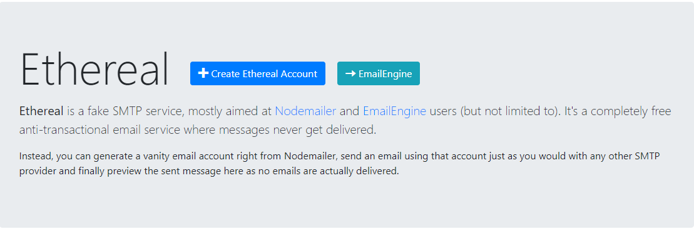
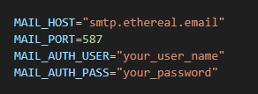
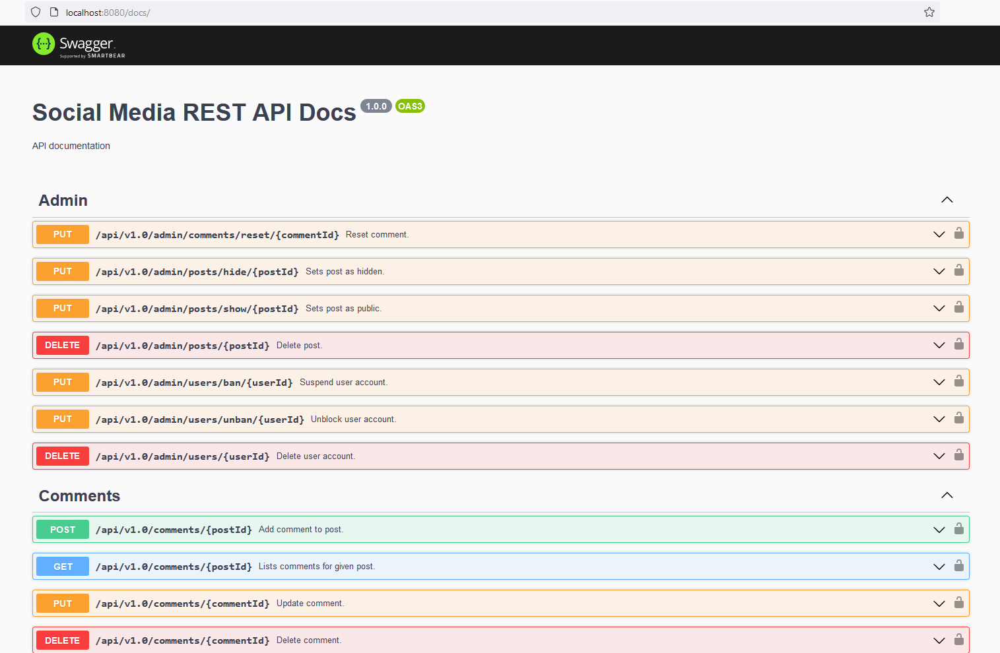

# WaveUp - Social Media - REST API

Welcome to WaveUp, a social media application where you can connect with friends, share your thoughts,experiences and memories through posts.
This README file provides an overview of the application, its features, and instructions for getting started. This repository contains REST API of WaveUp application, built using Express.js 

## Important
- You can find client application at following link - [Waveup Frontend](https://www.google.com)
- This is a development version and use deprecated nodemailer version only for testing purposes. 
- Development version run only on SQLite Database. Both environment variables and migration scripts are not prepared for deployment on PostgreSQL. 

## Getting Started
To run the WaveUp application locally, follow these steps:

### Prerequisites
Before running the WaveUp, make sure you have the following installed:
-	[Node.js](https://nodejs.org/en)

### Getting Started
To get started with WaveUp, follow these steps:

1.  Download code or clone the repository.
2.	Navigate to the project directory.
3.	Install the dependencies:
```
npm install
```
4.	Set up the environment variables:

- Create a [Etheral](https://ethereal.email/) account, or use other provider.



-	Fill in the following variables in .env files:



5.	Start the application:
- Run in development mode:
```
npm run dev
```
- Run in production mode:
```
npm start
```
6. Open your web browser and visit http://localhost:8080/docs to access WaveUp Swagger documentation.




### Testing 
1.	Run tests in memory:
```
npm test
```
2.	Run tests on real database:
```
npm run test:staging
```
### Other scripts
1.	Run sequelize migration scripts:
```
npm run migrate
```
2.	Clean up your uploads directories by running following script (set NODE_ENV variable):
```
npm run cleanup
```


## Features
- User Registration: Users can create an account on WaveUp by providing their accountname, email address, and password. Once registered, they can log in to their accounts.
- Account Activation: After registering, users are required to complete an email verification process.The user needs to click on the activation link sent to their email in order to verify and activate their account. 
- Account Recovery: When a user realizes they cannot access their account due to a forgotten password, they can initiate the account recovery process and set new password.
- User Profile: Each user has a profile that showcases their data and posts. Users can customize their profile by adding personal information and uploading a profile picture.
- Post Creation: Users can create posts to share their thoughts, ideas, or experiences. They can include text, images, or both in their posts.
- Post Interactions - Comments: Users can add comments to posts, allowing for discussions and conversations around specific topics.
- Post Interactions - Likes: Users can express their appreciation for posts by adding likes to them.
- Search: Users can search for other users using username, or account names.
- Posts Listing and Pagination: Users can scroll through the list of posts to explore content. Pagination divides posts into pages, displaying a specific number of posts per page. User can also filter posts based on date.

## Technologies Used

WaveUp is built using the following key technologies and dependencies:
- Node.js - v18.15.0
- NPM - 9.5.0
- Express.js - 4.18.2
- Express Validator - 6.15.0
- Express Rate Limit - 6.7.0
- Sequelize - 6.29.3
- Sequelize CLI - 6.6.0
- Sqlite3 - 5.1.6
- i18next - 22.4.1
- i18next Fs Backend - 2.1.1
- i18next HTTP Middleware - 3.3.0
- Swagger JSDOC - 6.2.8
- Swagger UI Express - 4.6.2
- Dotenv - 16.0.3
- Cross ENV - 7.0.3
- Multer - 1.4.5-lts.1
- File Type - 16.5.3
- UUID - 9.0.0
- Bcrypt - 5.1.0
- Jsonwebtoken - 9.0.0
- CORS - 2.8.5
- Helmet - 6.1.5
- HPP - 0.2.3
- Winston - 3.8.2
- Nodemon - 2.0.21
- SMTP Server - 3.11.0
- Nodemailer - 4.7.0
- Jest - 29.5.0
- Supertest - 6.3.3


